# Project Management System

A web application for managing projects, deliverables, and tasks with dedicated portals for project managers, team members, clients, and vendors.

This repository contains the **frontend application** — a Vue 3 + Vite + Frappe UI SPA that talks to an existing **Frappe backend**. All business logic, DocTypes, workflows, permissions, and APIs live in the backend; this frontend consumes those APIs.

---

## Table of Contents

- [Project Overview](#project-overview)
- [Key Features](#key-features)
- [User Roles](#user-roles)
- [Application Flow](#application-flow)
- [Role-Based Application Flow](#role-based-application-flow)
- [Frontend Architecture](#frontend-architecture)
- [Project Structure](#project-structure)
- [Pages / Screens](#pages--screens)
- [Components](#components)
- [API Integration](#api-integration)
- [Backend Integration](#backend-integration)
- [Workflow](#workflow)
- [Project Progress Flow](#project-progress-flow)
- [Task and Deliverable Relationship](#task-and-deliverable-relationship)
- [Authentication](#authentication)
- [Installation](#installation)
- [Environment Configuration](#environment-configuration)
- [Development Workflow](#development-workflow)
- [Screenshots](#screenshots)
- [Complete User Journey](#complete-user-journey)
- [Feature-to-Page Mapping](#feature-to-page-mapping)
- [Technologies Used](#technologies-used)
- [Design System / UI](#design-system--ui)
- [Responsive Design](#responsive-design)
- [Error Handling / Loading States](#error-handling--loading-states)
- [Future Improvements](#future-improvements)
- [Contribution](#contribution)
- [License](#license)

---

## Project Overview

**Project Management System** is a project delivery workspace where teams plan projects, break them down into **deliverables**, and manage the **tasks** needed to complete them.

The application solves a coordination problem: clients, managers, team members, and external vendors all need to follow a project through its lifecycle — from planning to delivery, approval, and rework — without losing track of progress, time, comments, or files.

### Who uses it

| Role             | How they use it                                             |
| ---------------- | ----------------------------------------------------------- |
| Project Manager  | Creates and runs projects, assigns work, tracks everything  |
| Project Member   | Executes tasks, logs time, submits deliverables for approval |
| Client           | Reviews deliverables, approves them or requests changes     |
| Vendor           | Fulfils assigned tasks and submits completed deliverables   |

### What the frontend is responsible for

- Rendering all screens (dashboards, lists, detail views, forms, Gantt chart, reports)
- Role-based routing and navigation
- Calling backend APIs to read and update data
- Client-side filtering, progress display, and feedback

### How it communicates with the Frappe backend

The frontend is a **same-origin SPA** served by Frappe. It makes `frappeRequest` (Axios-based) calls to **whitelisted Frappe API methods** under `project_management.api.*`, using the session cookie and a CSRF token for authentication. It never touches the database directly.

---

## Key Features

- **Project management** — create, edit, view, and delete projects; assign a client, manager, members, and vendors
- **Manager dashboard** — overview stats, project progress, daily/weekly progress report, recent tasks, quick actions
- **Deliverable management** — create deliverables under a project and drive them through an approval workflow
- **Task management** — create/edit tasks with assignee, vendor, priority, dates, and estimated hours
- **Task status management** — `Open`, `Working`, `Blocked`, `Completed`
- **Deliverable workflow** — `Draft → WIP → Ready for Approval → Awaiting Client Review → Approved / Changes Requested`
- **Project progress tracking** — percentage progress computed from completed tasks
- **Time logging** — log hours against a task; view per-task logs and today's total hours
- **Today's Focus** — members star tasks to pin them to a daily focus list
- **Comments** — add, edit, and delete comments on projects, deliverables, and tasks
- **Attachments** — upload/download files on projects, deliverables, and tasks
- **Gantt chart** — visual timeline of task schedules for a project
- **Reports** — daily/weekly progress reports per project
- **Notifications** — in-app notification list in the top bar
- **Member portal** — dashboard of my tasks, my projects, my deliverables, and today's focus
- **Client portal** — dashboard of my projects and deliverables, plus review/approval actions
- **Vendor portal** — dashboard of assigned tasks/deliverables and delivery submission
- **Authentication** — login, registration, and role-based screen access
- **Role-based screens** — separate navigation and routes per role

---

## User Roles

The application has four roles, enforced in the backend by Frappe permissions and mirrored in the frontend router guard and sidebar.

### Project Manager

- Create, edit, and delete projects
- Assign clients, project managers, members, and vendors to a project
- Create deliverables and tasks
- Advance deliverables through the approval workflow (`Start Work`, `Send for Approval`)
- Update task status, edit tasks, log time
- View Gantt charts and daily/weekly reports
- Access every portal for visibility

### Project Member

- View projects and deliverables they are part of
- See tasks assigned to them on a personal dashboard
- Update task status (`Open`, `Working`, `Blocked`, `Completed`)
- Log time against tasks
- Star tasks for "Today's Focus"
- Drive deliverables: `Start Work`, `Submit for Approval`, `Start Rework`
- Comment and attach files

### Client

- View the projects and deliverables associated with their account
- Review deliverables in `Awaiting Client Review`
- `Approve` a deliverable or `Request Changes` (optionally with feedback comment)
- View tasks, progress, members, files, and comments
- Invite members to a project

### Vendor

- View projects, deliverables, and tasks assigned to their vendor account
- Update task status and log time
- `Start Work` / `Start Rework` on deliverables
- `Submit Delivery` with an attached file and delivery note/access link

---

## Application Flow

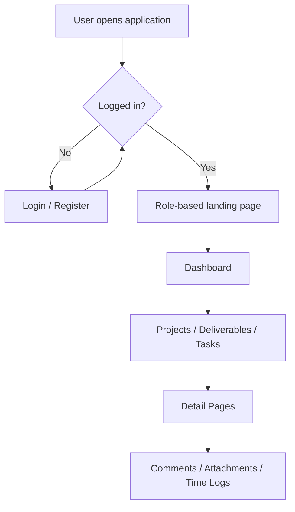

In practice the flow is:

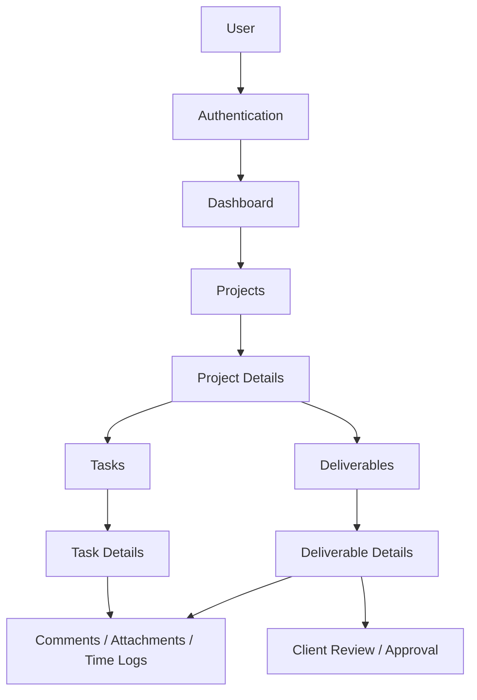

---

## Role-Based Application Flow

### Project Manager Flow

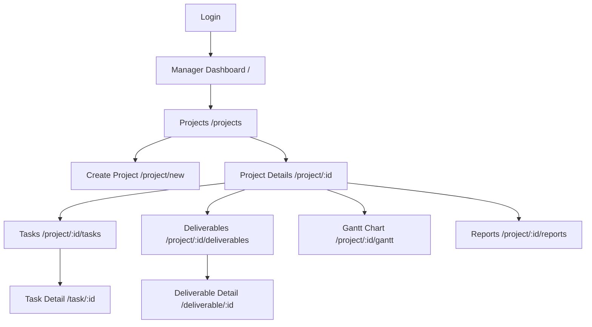

### Project Member Flow

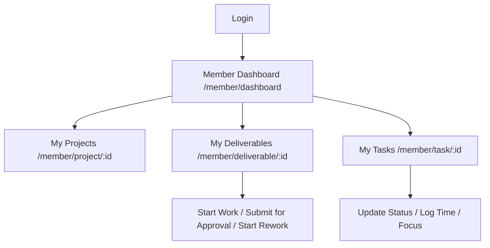

### Client Flow

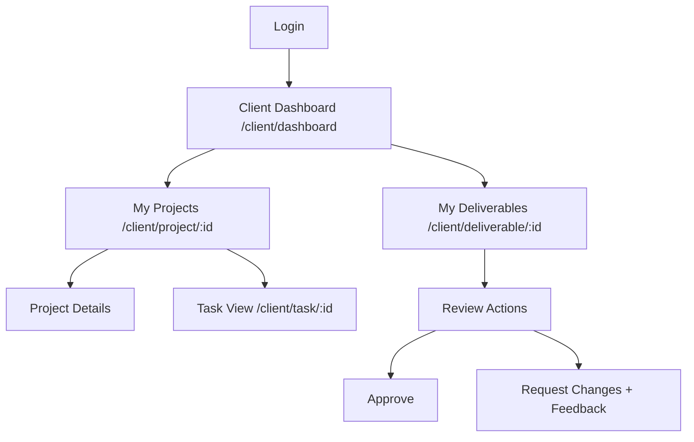

### Vendor Flow

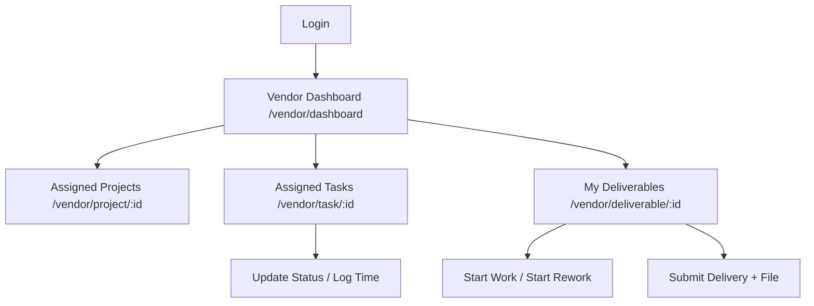

---

## Frontend Architecture

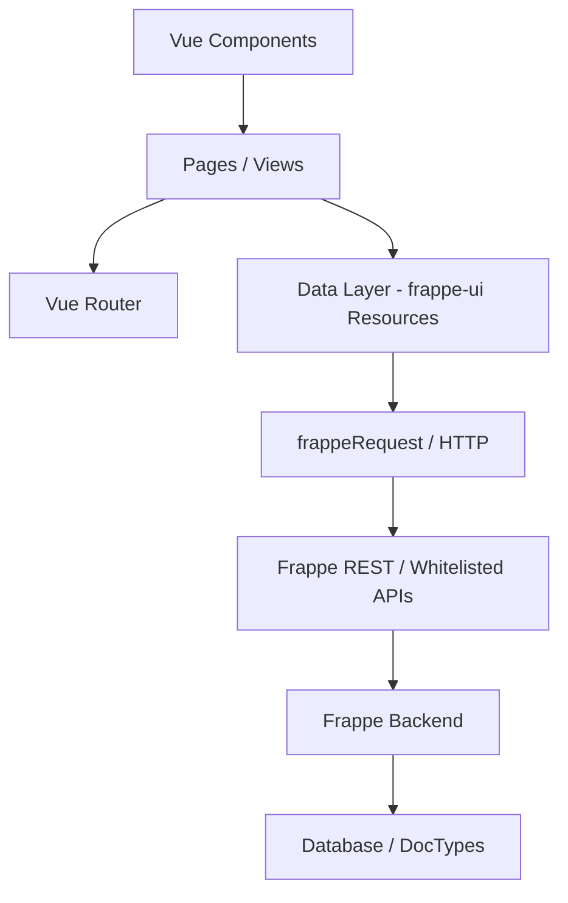

| Layer                    | Responsibility                                                        |
| ------------------------ | --------------------------------------------------------------------- |
| Vue Components           | Reusable UI pieces (`ProgressBar`, `CommentSection`, `FileUpload`...)  |
| Pages / Views            | Route-level screens under `src/pages/`                                 |
| Vue Router               | Declares routes and enforces role-based guards                         |
| Data layer               | `src/data/` — frappe-ui `createResource` factories + session state     |
| `frappeRequest` (HTTP)   | Frappe UI's Axios wrapper that calls `/api/method/...`                 |
| Frappe whitelisted APIs  | Backend endpoints in `project_management.api.*`                        |
| Frappe backend           | DocTypes, workflows, permissions, and business logic                   |

Every page fetches data through either a **resource** from `src/data/resources.js` (e.g. `useProject`, `useTasks`) or a direct `frappeRequest` call. No page calls the Frappe API by URL string everywhere — all endpoints are centralized in the data layer and page scripts.

---

## Project Structure

```text
frontend/
├── docs/
│   └── screenshots/          # Screenshot images for the README
├── public/                   # (dev) static public assets
├── src/
│   ├── components/
│   │   ├── layout/           # App shell: AppLayout, Sidebar, Topbar
│   │   ├── ActivityTimeline.vue
│   │   ├── CommentSection.vue
│   │   ├── EmptyState.vue
│   │   ├── FileUpload.vue
│   │   └── ProgressBar.vue
│   ├── data/
│   │   ├── resources.js      # frappe-ui resource factories (all API calls)
│   │   ├── session.js        # session user, roles, portal routing helper
│   │   └── store.js          # tiny reactive global store
│   ├── pages/
│   │   ├── client/           # Client portal screens
│   │   ├── manager/          # Project Manager screens
│   │   ├── member/           # Project Member portal screens
│   │   ├── vendor/           # Vendor portal screens
│   │   ├── Login.vue
│   │   ├── Register.vue
│   │   └── NoAccess.vue
│   ├── utils/
│   │   └── statusColors.js   # status -> badge colour mapping
│   ├── App.vue               # Root component (router-view + ToastProvider)
│   ├── index.css             # Tailwind/Frappe UI entry styles
│   ├── main.js               # App bootstrap
│   └── router.js             # Route table + auth/role guards
├── index.html                # HTML shell + CSRF token bootstrap
├── package.json
├── postcss.config.js
├── tailwind.config.js        # Extends frappe-ui/tailwind preset
├── vite.config.mjs           # Vite + Frappe UI plugin config
└── README.md
```

| Path                       | Purpose                                              |
| -------------------------- | ---------------------------------------------------- |
| `src/pages`                | Route-level screens, grouped by role                 |
| `src/pages/manager`        | Project Manager workspace                            |
| `src/pages/member`         | Member portal                                        |
| `src/pages/client`         | Client portal                                        |
| `src/pages/vendor`         | Vendor portal                                        |
| `src/components`           | Reusable Vue components                              |
| `src/components/layout`    | Application shell (sidebar/topbar)                   |
| `src/data`                 | API resources, session state, and store              |
| `src/router.js`            | Routing + guards                                     |
| `src/utils/statusColors.js`| Status → colour mapping for badges/progress          |
| `docs/screenshots`         | README screenshot images                             |

---

## Pages / Screens

### Public

| Page      | Route         | Purpose                                        |
| --------- | ------------- | ---------------------------------------------- |
| Login     | `/login`      | Sign in with email/password via Frappe `login` |
| Register  | `/register`   | Self-register as Member, Client, or Vendor     |
| No Access | `/no-access`  | Shown when the account has no allowed role     |

### Project Manager

| Page                | Route                     | Purpose                                          |
| ------------------- | ------------------------- | ------------------------------------------------ |
| Manager Dashboard   | `/`                       | Overview stats, project progress, reports, tasks |
| Projects            | `/projects`               | Searchable/filterable project list               |
| All Deliverables    | `/deliverables`           | Deliverables across all projects                 |
| All Tasks           | `/tasks`                  | Tasks across all projects                        |
| Create Project      | `/project/new`            | Project creation form                            |
| Project Details     | `/project/:id`            | Progress, tasks, deliverables, members, vendors  |
| Edit Project        | `/project/:id/edit`       | Edit project form                                |
| Gantt Chart         | `/project/:id/gantt`      | Timeline of project tasks                        |
| Deliverables        | `/project/:id/deliverables`| Deliverables within a project                    |
| Tasks               | `/project/:id/tasks`      | Tasks within a project                           |
| Reports             | `/project/:id/reports`    | Daily/weekly progress report                     |
| Deliverable Detail  | `/deliverable/:id`        | Deliverable info, workflow actions, tasks        |
| Task Detail         | `/task/:id`               | Task info, status updates, time logs             |

### Member Portal

| Page                  | Route                       | Purpose                                        |
| --------------------- | --------------------------- | ---------------------------------------------- |
| Member Dashboard      | `/member/dashboard`         | My tasks, projects, deliverables, focus list   |
| Project Details       | `/member/project/:id`       | Read-only project overview                     |
| Task                  | `/member/task/:id`          | Task details, status, time logs, focus toggle  |
| Deliverable           | `/member/deliverable/:id`   | Deliverable details and workflow actions       |

### Client Portal

| Page             | Route                     | Purpose                                            |
| ---------------- | ------------------------- | -------------------------------------------------- |
| Client Dashboard | `/client/dashboard`       | My projects and deliverables                       |
| Project          | `/client/project/:id`     | Project progress, members, deliverables, tasks     |
| Task             | `/client/task/:id`        | Read-only task view with comments                  |
| Deliverable      | `/client/deliverable/:id` | Deliverable review (approve / request changes)     |

### Vendor Portal

| Page             | Route                     | Purpose                                              |
| ---------------- | ------------------------- | ---------------------------------------------------- |
| Vendor Dashboard | `/vendor/dashboard`       | Assigned tasks, deliverables, projects, action items |
| Project          | `/vendor/project/:id`     | Project overview with your deliverables and tasks    |
| Task             | `/vendor/task/:id`        | Task details, status, time logs                      |
| Deliverable      | `/vendor/deliverable/:id` | Deliverable details and delivery submission          |

---

## Components

| Component              | Path                                      | Purpose                                             |
| ---------------------- | ----------------------------------------- | --------------------------------------------------- |
| `AppLayout`            | `src/components/layout/AppLayout.vue`     | App shell: collapsible sidebar + topbar + content   |
| `Sidebar`              | `src/components/layout/Sidebar.vue`       | Role-aware navigation (Frappe UI `Sidebar`)          |
| `Topbar`               | `src/components/layout/Topbar.vue`        | Notifications dropdown, profile dropdown, logout    |
| `ProgressBar`          | `src/components/ProgressBar.vue`          | Coloured percentage progress bar                    |
| `CommentSection`       | `src/components/CommentSection.vue`       | Add/edit/delete comments on any doctype             |
| `FileUpload`           | `src/components/FileUpload.vue`           | Upload/list/delete files for projects, deliverables, tasks |
| `EmptyState`           | `src/components/EmptyState.vue`           | Reusable empty state placeholder                    |
| `ActivityTimeline`     | `src/components/ActivityTimeline.vue`     | Vertical activity feed                              |

Frappe UI primitives used throughout: `Button`, `Badge`, `Input`, `Select`, `Autocomplete`, `Dialog`, `Avatar`, `LoadingIndicator`, `Skeleton`, `Progress`, `Icon`, `Dropdown`, `Tooltip`, `ToastProvider`, and the `List` family (`List`, `ListRow`, `ListCell`, `ListHeader`, `ListHeaderCell`, `ListRows`).

---

## API Integration

All calls target the Frappe backend. Endpoints are grouped by backend module. The exact methods are defined in `src/data/resources.js` and page scripts.

### `project_management.api.client.*`

| API method                          | Used by                                         |
| ----------------------------------- | ----------------------------------------------- |
| `get_session_user`                  | Router guard, dashboards, assign-to-me actions  |
| `get_csrf_token`                    | `index.html` bootstrap (CSRF setup)             |
| `get_profile`                       | Topbar profile dropdown                         |
| `get_notifications`                 | Topbar notifications                            |
| `get_form_options`                  | Project form (clients, managers, members, vendors) |
| `get_projects`                      | Project list, dashboards, filters               |
| `get_project`                       | Project detail/form pages                       |
| `get_deliverables`                  | Deliverable/task lists                          |
| `get_deliverables_with_details`     | Deliverable lists (with task counts)            |
| `get_deliverable`                   | Deliverable detail pages                        |
| `get_deliverable_access`            | Deliverable pages (can-manage check)            |
| `get_deliverable_for_task`          | Member/vendor task pages                        |
| `get_tasks`                         | Task lists and detail pages                     |
| `get_task`                          | Task detail pages                               |
| `get_time_logs`                     | Task detail pages                               |
| `get_today_hours`                   | Member/vendor dashboards, task pages            |
| `get_member_projects`               | Member dashboard, member project guard          |
| `get_my_projects`                   | Client dashboard                                |
| `get_gantt_tasks`                   | Gantt chart                                     |
| `get_progress_report`               | Manager dashboard, reports page                 |
| `get_comments` / `add_comment` / `edit_comment` / `delete_comment` | CommentSection on all entities |
| `create_project` / `update_project` / `delete_project` | Project form + project detail    |
| `create_task` / `update_task` / `update_task_status` | Task list + task detail          |
| `create_deliverable` / `update_deliverable_status` | Deliverable list + deliverable pages |
| `create_time_log`                   | Time-log modals                                 |
| `toggle_today_focus`                | Member dashboard + task page                    |
| `invite_project_member`             | Client project view                             |

### `project_management.api.vendor.*`

| API method           | Used by                          |
| -------------------- | -------------------------------- |
| `get_vendor_projects`| Vendor dashboard                |
| `get_vendor_project` | Vendor project view             |
| `get_vendor_deliverables` | Vendor dashboard           |
| `get_vendor_tasks`   | Vendor dashboard                |
| `submit_deliverable` | Vendor deliverable page (Submit Delivery) |

### `project_management.api.file.*`

| API method | Used by (doctype)              |
| ---------- | ------------------------------ |
| `get_project_files` / `upload_project_file` / `delete_project_file`   | Project Info files |
| `get_deliverable_files` / `upload_deliverable_file` / `delete_deliverable_file` | Deliverable files |
| `get_task_files` / `upload_task_file` / `delete_task_file` | Project Task files |

### `project_management.api.auth.*`

| API method         | Used by    |
| ------------------ | ---------- |
| `create_portal_user` | Register page |

### Frappe standard

| Method   | Used by                    |
| -------- | -------------------------- |
| `login`  | Login page, Topbar logout  |
| `logout` | Topbar, NoAccess page      |

---

## Backend Integration

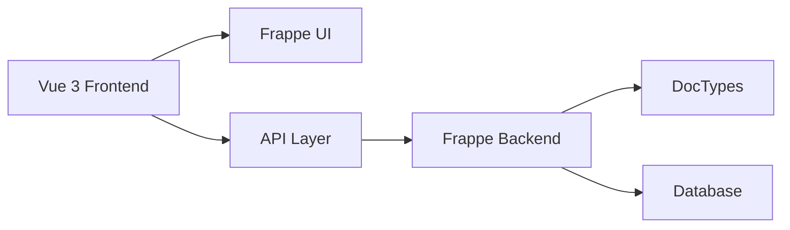

The frontend consumes existing Frappe APIs and never re-implements business logic.

- **Frontend responsibilities:** rendering, routing, role-based UI, form capture, client-side filtering, calling APIs, showing progress/errors.
- **Backend responsibilities:** DocTypes (`Project Info`, `Deliverable`, `Project Task`, `Project Member`, `Project Vendors`, `Vendor`, `Deliverable Task`, `Time Log`), permissions, the deliverable workflow, data validation, and calculations (e.g. progress percentages).

The deliverables' workflow is executed on the backend through Frappe's `apply_workflow`; the frontend simply sends the chosen action name.

---

## Workflow

### Deliverable workflow

States (as defined in the backend `Deliverable` doctype): `Draft`, `WIP`, `Ready for Approval`, `Awaiting Client Review`, `Approved`, `Changes Requested`.

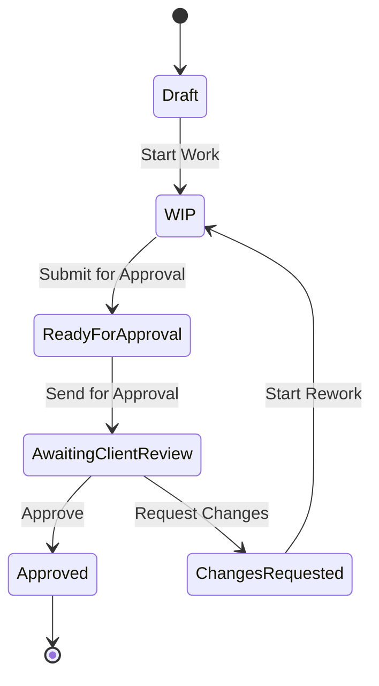

Actions shown per role in the frontend:

| Role            | Available actions                                        |
| --------------- | -------------------------------------------------------- |
| Project Manager | `Start Work`, `Send for Approval`                        |
| Project Member  | `Start Work`, `Submit for Approval`, `Start Rework`      |
| Client          | `Approve`, `Request Changes` (when `Awaiting Client Review`) |
| Vendor          | `Start Work`, `Start Rework`, `Submit Delivery`          |

### Task workflow

Tasks use a simple status model: `Open → Working → Blocked → Completed`. Any status can be set directly from the task detail page, subject to backend permissions.

---

## Project Progress Flow

Progress is derived from completed tasks. The frontend displays it as a percentage via `ProgressBar` and computes deliverable progress locally (`completed tasks / total tasks`), while overall project progress is returned by the backend API.

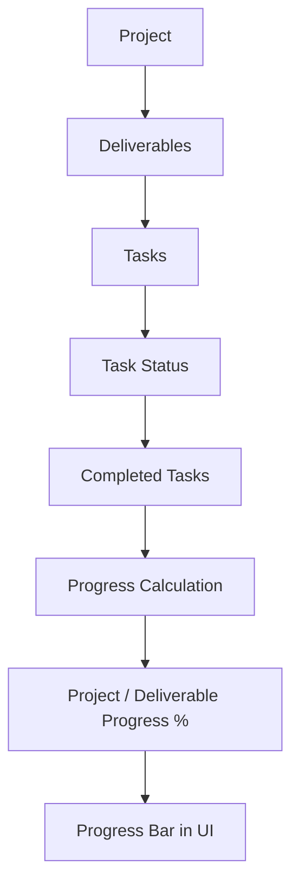

---

## Task and Deliverable Relationship

A project contains deliverables, and each deliverable contains tasks. Tasks belong to exactly one deliverable (and therefore one project).

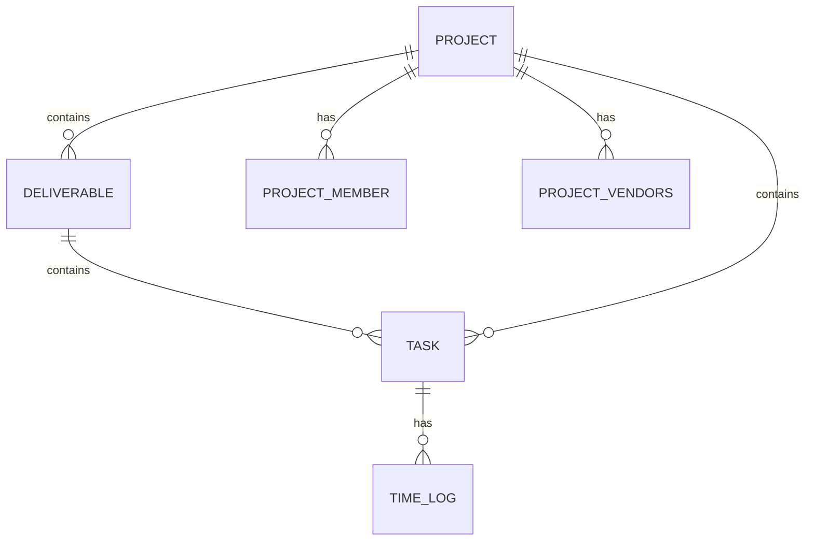

---

## Authentication

- **Login** — the Login page posts to the standard Frappe `login` endpoint (`usr`/`pwd`) and reloads the page. Login is only functional when served on the Frappe domain.
- **Session** — `src/data/session.js` fetches the session user via `get_session_user` and exposes `user`, `roles`, and `isLoggedIn` reactively.
- **Router guard** — every navigation first resolves the session. Unauthenticated users are sent to `/login`. Public routes (`/login`, `/register`) are whitelisted with `meta.public`.
- **Role guard** — routes declare `meta.roles` (e.g. `['Project Manager']`). If the user's roles don't match, they are redirected to their portal or `/no-access`.
- **Portal routing** — `getPortal()` maps role → landing page:
  - `Client` → `/client/dashboard`
  - `Project Manager` → `/`
  - `Project Member` → `/member/dashboard`
  - `Vendor` → `/vendor/dashboard`
- **CSRF** — `index.html` fetches a CSRF token on boot (`get_csrf_token`) and stores it in `window.csrf_token`, used by file uploads.
- **Logout** — posts to `logout` then redirects to `/project_management/login`.

---

## Installation

### Prerequisites

- **Node.js** (project uses Vite 5)
- **npm**
- A running **Frappe / Bench** environment with the `project_management` app installed, migrated, and serving a site
- Backend site URL reachable on the same origin as the frontend

### Clone Repository

```bash
git clone <repository-url>
cd project_management/frontend
```

### Install Dependencies

```bash
npm install
```

### Start Development Server

```bash
npm run dev
```

The Vite dev server runs on **port 8080** (`http://localhost:8080`).

### Build for Production

```bash
npm run build
```

The production build outputs a manifest into `../project_management/public/frontend`, from which Frappe serves the app under `/assets/project_management/frontend/`.

---

## Environment Configuration

The frontend currently has **no `.env` files and no environment variables**. API calls are made to relative same-origin paths (`/api/method/...`), so no base-URL configuration is required.

> **Note for development:** because calls are same-origin, the dev server must reach the Frappe backend at `/api/...`. In this setup the app is intended to be served by Frappe itself (see the build output path in `vite.config.mjs`).

No secrets, tokens, or credentials are stored in the repository.

---

## Development Workflow

1. Start the Frappe backend and ensure the `project_management` app is installed and migrated.
2. Start the frontend dev server (`npm run dev`, port 8080) — or build and serve via Frappe.
3. Open the application in your browser.
4. Log in (or register a new account as Member/Client/Vendor).
5. You land on the dashboard for your role.
6. Project Managers: create projects, deliverables, and tasks; assign members/vendors.
7. Members/Vendors: work on tasks, log time, update status, and submit deliverables.
8. Clients: review deliverables and approve or request changes.

---

## Screenshots

> Screenshots are placeholders — add your own images to `docs/screenshots/` and keep the filenames matching.

### Login

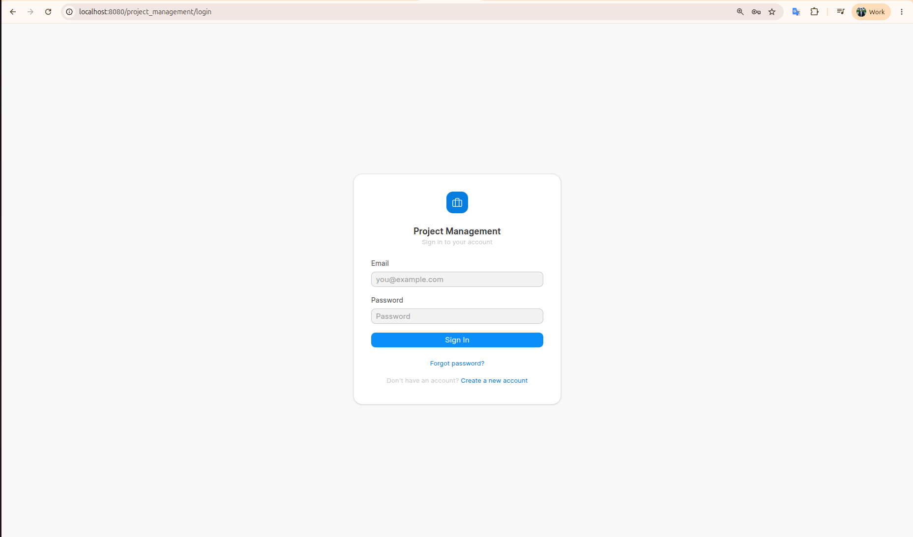

### Manager Dashboard


### Projects


### Project Details


### Tasks


### Deliverables


### Gantt Chart


### Member Portal


### Client Portal


### Vendor Portal


---

## Complete User Journey

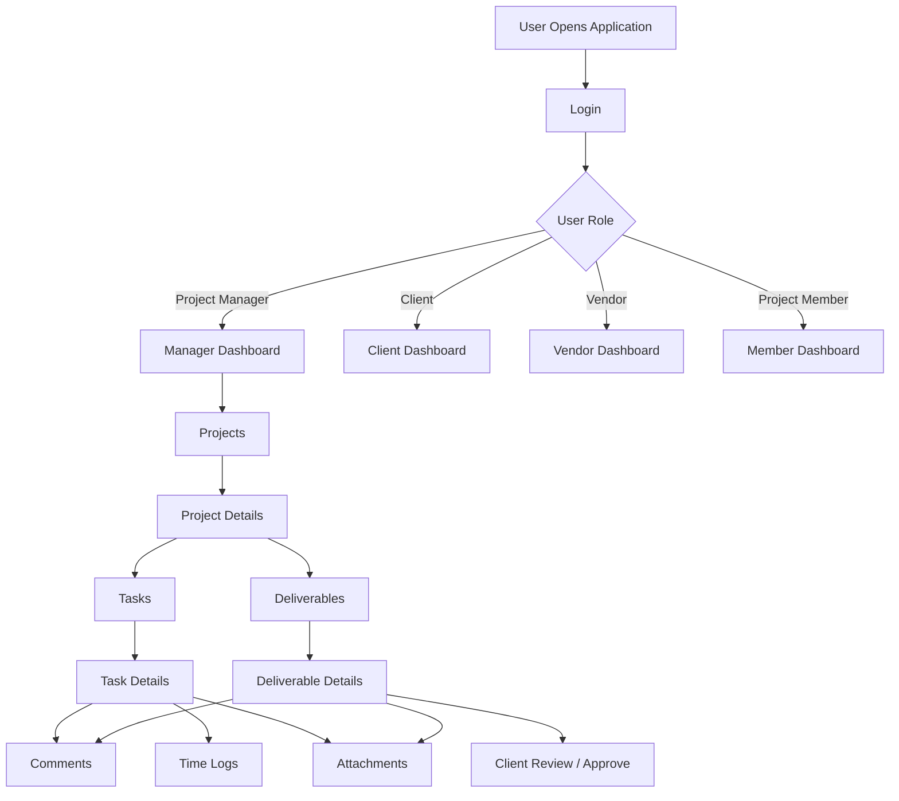

---

## Feature-to-Page Mapping

| Feature                | Page                     | Component / API                       |
| ---------------------- | ------------------------ | ------------------------------------- |
| Projects list          | Projects (`/projects`)   | `ProjectList` / `get_projects`        |
| Create/edit project    | Project form             | `ProjectForm` / `create_project`, `update_project` |
| Project progress       | Project details          | `ProgressBar` / `get_project`         |
| Deliverables           | Deliverable lists/detail | `DeliverableList`, `DeliverableDetail` |
| Create deliverable     | Deliverable list modal   | `create_deliverable`                  |
| Deliverable workflow   | Deliverable detail       | `update_deliverable_status`           |
| Tasks                  | Task list/detail         | `TaskList`, `TaskDetail`              |
| Create/edit task       | Task modals              | `create_task`, `update_task`          |
| Task status            | Task detail              | `update_task_status`                  |
| Time logging           | Task detail              | `Time Logs` panel / `create_time_log` |
| Comments               | Project/deliverable/task | `CommentSection`                      |
| Attachments            | Project/deliverable/task | `FileUpload` / `project_management.api.file.*` |
| Gantt chart            | Gantt chart              | `GanttChart` / `get_gantt_tasks`      |
| Reports                | Reports page             | `Reports` / `get_progress_report`     |
| Notifications          | Topbar                   | `get_notifications`                   |
| Member focus           | Member dashboard/task    | `toggle_today_focus`                  |
| Client review          | Client deliverable       | `ClientDeliverableView`               |
| Vendor delivery        | Vendor deliverable       | `submit_deliverable`                  |
| Member invite          | Client project           | `invite_project_member`               |

---

## Technologies Used

```text
Vue 3
Vite 5
Frappe UI (1.0.0-beta.29)
Vue Router 4
Feather Icons
Tailwind CSS 3 (Frappe UI preset)
PostCSS / Autoprefixer
Frappe Framework (backend, via whitelisted APIs)
```

---

## Design System / UI

The UI follows the **Frappe UI design system**:

- Frappe UI components (`Button`, `Badge`, `Avatar`, `Dialog`, `Input`, `Select`, `Autocomplete`, `Toast`, `Dropdown`, `Tooltip`)
- Frappe UI `List` views with styled list rows and cells
- `Sidebar`, `SidebarItem`, `SidebarLabel` for navigation
- Frappe UI Tailwind preset for spacing/colour tokens (`surface-*`, `ink-*`, `outline-*`)
- Status badges coloured via `src/utils/statusColors.js`
- Progress indicators via the custom `ProgressBar` component
- Card-based layouts (`bg-white rounded-xl border border-gray-200`) for dashboards and detail pages
- Modals for create/edit forms and confirmations
- Feather icons alongside Frappe UI's Lucide-style icons

---

## Responsive Design

The application is primarily a desktop workspace, but uses responsive Tailwind classes:

- **Desktop** — full multi-column grids, sidebars, and wide list views
- **Tablet / mobile** — responsive grids collapse (`grid-cols-1`, `md:grid-cols-*`, `lg:grid-cols-3`), and the sidebar is collapsible
- The vendor dashboard hides secondary columns on small screens (`max-sm:hidden`) and overrides the list grid for mobile (`max-sm:[--list-columns:...]`)
- Utility classes such as `sm:w-72`, `sm:w-auto`, `grid-cols-2 md:grid-cols-4` adapt forms and stat cards to smaller viewports

---

## Error Handling / Loading States

- **Loading** — `LoadingIndicator` shown while API requests are in flight on list and detail pages
- **Empty states** — the reusable `EmptyState` component with icon + message, plus inline "No projects / tasks / deliverables" text
- **API failures** — fetch errors are caught and the page falls back to an empty array (and `console.error`), preventing crashes
- **Delete confirmation** — destructive actions use a `Dialog` with an explicit confirm step
- **Form validation** — required fields disable submit buttons (e.g. task/deliverable title, invite email) and inline error messages are shown (e.g. duplicate members, password mismatch on registration)
- **Skeleton loaders** — the vendor dashboard uses `Skeleton` placeholders while loading
- **Notifications** — success/error toasts via `ToastProvider`

---

## Future Improvements

> These are **possible future enhancements**, not currently implemented features.

- Add automated end-to-end tests for routing and role-based access
- Add dark mode support
- Introduce a global search across projects, deliverables, and tasks
- Add drag-and-drop task prioritisation (kanban-style boards)
- Add CSV/PDF export for reports
- Add internationalisation (i18n) for multi-language support

---

## Contribution

1. Fork and clone the repository.
2. Create a feature branch:

   ```bash
   git checkout -b feature/your-feature-name
   ```

3. Make your changes to the frontend source.
4. Test the application (`npm run dev` with a running backend, or `npm run build`).
5. Commit and push your branch, then open a pull request describing your change.

---

## License

The frontend repository itself does not yet declare a license. The parent `project_management` Frappe app includes an `MIT License` in `license.txt` at the app root.

```text
License information has not been specified yet.
```
